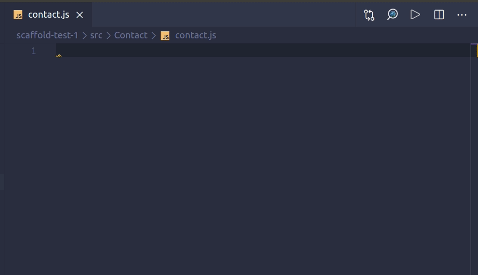

# Magento PWA Studio Snippets for VS Code

This extension for Visual Studio Code adds snippets for Magento PWA Studio.

See the [CHANGELOG](CHANGELOG.md) for the latest changes

## Usage

Type part of a snippet, press `enter`, and the snippet unfolds.

Alternatively, press `Ctrl`+`Space` (Windows, Linux) or `Cmd`+`Space` (macOS) to activate snippets from within the editor.

### JavaScript Snippets

| Snippet                      | Purpose                                                              |
| ---------------------------- | -------------------------------------------------------------------- |
| `pwa-comp`                | component                                                            |
| `pwa-snap-test`                | snapshot test                                                        |